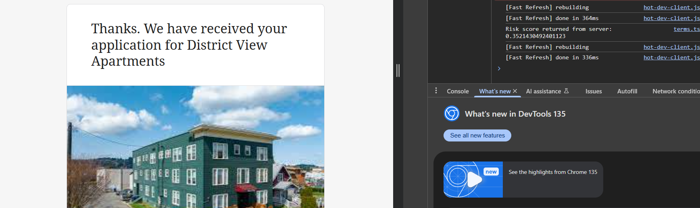
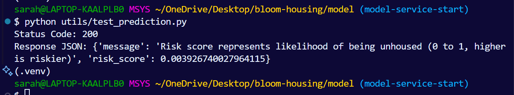
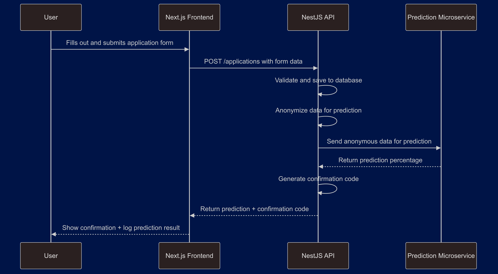

# 🏠 Housing Risk Prediction Microservice

This is a Flask-based microservice within the [`bloom-housing`](https://github.com/SarahE-Dev/bloom-housing) monorepo. It powers housing instability screening by providing a `/predict` endpoint that returns a risk score based on anonymized housing application data.

This service is intended to be consumed by the main NestJS backend via `http://localhost:5000/predict`.

> 📢 **Note**: If you're running this via Docker, update the `application-service` endpoint in NestJS accordingly.

---

## 🧰 Technologies Used

- **Python 3.10**
- **Flask** – Micro web framework for the API
- **XGBoost** – Machine Learning Library
- **Docker** – Containerization
- **Postman or curl** – API testing
- **VS Code + Python extensions** – Suggested for development

---

## 📸 Features & Screenshots

### ✅ Application submits and receives prediction in browser console



### 🧪 Local test request via `utils/test_prediction.py`



---

## 📋 Prerequisites

Before starting, make sure you have the following installed:

- Python 3.10+
- pip (Python package manager)
- Git
- Docker (optional for containerized runs)
- Your preferred env manager

---

## 📁 Folder Structure

```
model/
├── app/
│   ├── Dockerfile           # Model container setup
│   ├── main.py              # Flask app with /predict endpoint
│   ├── mock-model.pkl       # Mock XGBoost model (generated by utils/train_model.py)
│   └── requirements.txt     # Specific requirements for prediction container
│
├── images/
│   ├── browser-console.png       # Return of Risk Score after Form Submission in console
│   ├── microservice-flow.png     # Data flow diagram of form submission to prediction endpoint
│   └── test-console.png          # Output of running test_prediction.py for prediction endpoint
│
├── notebooks/
│   ├── 1-ahs_dataset_formatting.ipynb      # Initial data cleaning and feature engineering on AHS'23 Dataset
│   └── 2-model_selection.ipynb             # Model selection, experimentation, and explainability using AHS'23 Dataset
|
├── utils/
│   ├── test_prediction.py        # Sends test POST request to /predict endpoint
│   └── train_model.py            # Script to generate training data and save mock-model.pkl
│
├── docker-compose.yaml      # Builds and sets up container environment
├── requirements.txt         # Python dependencies (All container dependencies)
└── README.md                # You’re here!
```

---

## 💻 Installation & Setup (Locally)

1. **Clone the repo and navigate to `model/`:**

   ```bash
   git clone https://github.com/SarahE-Dev/bloom-housing.git
   cd bloom-housing/model
   ```

2. **Set up your virtual environment**:

   ```bash
   python -m venv .venv
   source .venv/bin/activate  # On Windows: .venv\Scripts\activate
   ```

3. **Install dependencies**:

   ```bash
   pip install -r requirements.txt
   ```

4. **Train the model**:

   ```bash
   python utils/train_model.py
   ```

5. **Run the Flask app**:

   ```bash
   cd app # Won't find model if you're not in the same directory
   python main.py
   ```

6. **Test the API**:

   In another terminal from the model directory:

   ```bash
   python utils/test_prediction.py
   ```

---

## 🐳 Running with Docker

1. **Build and Run the container**:

   ```bash
   docker compose up --build
   ```

   **NOTE:** You can drop the `--build` flag after the initial build to run the containers. If any changes are made, include it to rebuild the containers with the additions included.

2. **Test the endpoint**:

   ```bash
   python utils/test_prediction.py
   ```

---

## 📡 Prediction API

### `POST /predict`

Send anonymized housing-related features and receive a risk score.

#### Example Request Body:

```json
{
  "features": {
    "income": 1800,
    "household_size": 3,
    "housing_status": 1,
    "income_vouchers": true,
    "household_expecting_changes": false,
    "household_student": true
  }
}
```

> `housing_status` is a numeric encoding (e.g., 0: homeless, 1: renting, 2: stable)

#### Example Response:

```json
{
  "risk_score": 0.82,
  "message": "Risk score represents likelihood of being unhoused (0 to 1, higher is riskier)"
}
```

---

## 🔁 System Flow: Next.js → NestJS → Microservice

1. **Next.js frontend** gathers housing application data.
2. **NestJS backend** processes and anonymizes the request.
3. Sends a `POST` to `/predict` (this Flask service).
4. The **model** predicts and returns a risk score.

<p align="center">
  
</p>

---

## 🛠 Model Training Details

Model is trained using synthetic data generated by `train_model.py`, and saved to `app/mock-model.pkl`.

> ⚠️ Always re-train before deploying if you update the model logic or schema.

---

## 🧪 Testing

Run:

```bash
python utils/test_prediction.py
```

This sends a request to `/predict` and logs the response.

---

## 📈 Development Status & Roadmap

✅ MVP: Local and Dockerized version of the model.
🔲 Real Data Integration: Replace mock data with actual housing application data.
🔲 Data Transformation: Ensure proper data preprocessing, including encoding of categorical variables.
🔲 Model Tuning: Fine-tune the model hyperparameters and improve prediction accuracy.
🔲 Feature Expansion: Add more features to improve the risk prediction.
🔲 Cloud Integration: Prepare for deployment to cloud platforms like AWS or GCP.
🔲 Monitoring and Logging: Implement logging for better error handling and prediction tracking.

---

## 🙌 Acknowledgements

- Created as part of the [Bloom Housing](https://github.com/bloom-housing/bloom) initiative
- Thanks to the open-source communities behind Flask, XGBoost
- Inspired by real-world housing application risk screening needs

---

## 📄 License

MIT License — see the root `LICENSE` file for details.
