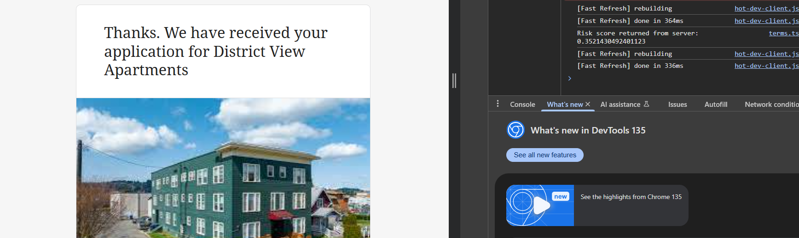
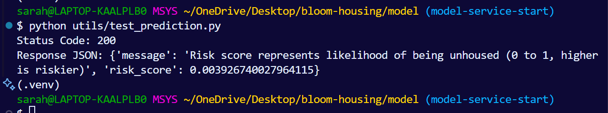

# 🏠 Housing Risk Prediction Microservice

This is a Flask-based microservice within the [`bloom-housing`](https://github.com/SarahE-Dev/bloom-housing) monorepo. It powers housing instability screening by providing a `/predict` endpoint that returns a risk score based on anonymized housing application data.

This service is intended to be consumed by the main NestJS backend via `http://localhost:5000/predict`.

> 📢 **Note**: If you're running this via Docker or Kubernetes, update the `application-service` endpoint in NestJS accordingly.

---

## 🧰 Technologies Used

- **Python 3.10**
- **Flask** – Micro web framework for the API
- **XGBoost** – Machine learning model for risk scoring
- **Docker** – Containerization
- **Kubernetes** – Deployment and orchestration
- **Minikube** – Local K8s cluster (for development/testing)
- **Postman or curl** – API testing
- **VS Code + Python extensions** – Suggested for development

---

## 📸 Features & Screenshots

### ✅ Application submits and receives prediction in browser console


### 🧪 Local test request via `utils/test_prediction.py`


---

## 📋 Prerequisites

Before starting, make sure you have the following installed:

- Python 3.10+
- pip (Python package manager)
- Git
- Docker (optional for containerized runs)
- Minikube & kubectl (optional for K8s)
- Your preferred env manager

---

## 📁 Folder Structure

```
model/
├── app/                               # Flask app and saved model
│   ├── main.py                        # The Flask app with the /predict route
│   └── model.pkl                      # The trained XGBoost model used for predictions
├── assets/                            # Images used in docs or README
│   ├── browser-console.png            # Screenshot showing prediction in browser console
│   ├── microservice-flow.png          # Diagram showing how data flows through the system
│   ├── risk_microservice_system_design_diagram.png # Diagram showing architecture of the system
│   ├── test-console.png               # Screenshot of test run in the terminal
├── docs/                              # Project documentation
│   └── developer_guide.md             # Guide for developers working on this service
├── utils/                             # Extra scripts for training and testing
│   ├── train_model.py                 # Creates and saves the model from training data
│   └── test_prediction.py             # Sends a test request to check the /predict route
├── Dockerfile                         # Instructions to run the app inside a Docker container
├── requirements.txt                   # List of Python packages the app needs
├── deployment.yaml                    # Kubernetes setup for deploying the app
├── service.yaml                       # Kubernetes config for exposing the app as a service
└── README.md                          # Main file with project info, setup steps, and usage
```

---

## 💻 Installation & Setup (Locally)

1. **Clone the repo and navigate to `model/`:**

   ```bash
   git clone https://github.com/SarahE-Dev/bloom-housing.git
   cd bloom-housing/model
   ```

2. **Set up your virtual environment**:

   ```bash
   python -m venv venv
   source venv/bin/activate  # On Windows: venv\Scripts\activate
   ```

3. **Install dependencies**:

   ```bash
   pip install -r requirements.txt
   ```

4. **Train the model**:

   ```bash
   python utils/train_model.py
   ```

5. **Run the Flask app**:

   ```bash
   cd app
   python main.py
   ```

6. **Test the API**:

   In another terminal from the model directory:

   ```bash
   python utils/test_prediction.py
   ```

---

## 🐳 Running with Docker

1. **Build the image**:

   ```bash
   docker build -t housing-service .
   ```

2. **Run the container**:

   ```bash
   docker run -p 5000:5000 housing-service
   ```

3. **Test the endpoint**:

   ```bash
   python utils/test_prediction.py
   ```

---

## ☸️ Deploying with Kubernetes (Minikube)

### 🔧 Start Minikube and build the image:

```bash
minikube start
eval $(minikube docker-env)
docker build -t housing-service .
```

### 📦 Apply Kubernetes configuration:

```bash
kubectl apply -f deployment.yaml
kubectl apply -f service.yaml
```

### 🌐 Expose the service:

To forward the service to your machine's port:

```bash
kubectl port-forward housing-service-loadbalancer 5000:5000
```

Or to open it in your browser:

```bash
minikube service housing-service-loadbalancer
```

---

## 📡 Prediction API

### `POST /predict`

Send anonymized housing-related features and receive a risk score.

#### Example Request Body:

```json
{
  "features": {
    "income": 1800,
    "household_size": 3,
    "housing_status": 1,
    "income_vouchers": true,
    "household_expecting_changes": false,
    "household_student": true
  }
}
```

> `housing_status` is a numeric encoding (e.g., 0: homeless, 1: renting, 2: stable)

#### Example Response:

```json
{
  "risk_score": 0.82,
  "message": "Risk score represents likelihood of being unhoused (0 to 1, higher is riskier)"
}
```

---

## 🔁 System Flow: Next.js → NestJS → Microservice

1. **Next.js frontend** gathers housing application data.
2. **NestJS backend** processes and anonymizes the request.
3. Sends a `POST` to `/predict` (this Flask service).
4. The **model** predicts and returns a risk score.

<p align="center">
  
</p>

---

## 🛠 Model Training Details

Model is trained using synthetic data generated by `train_model.py`, and saved to `app/model.pkl`.

> ⚠️ Always re-train before deploying if you update the model logic or schema.

---

## 🧪 Testing

Run:

```bash
python utils/test_prediction.py
```

This sends a request to `/predict` and logs the response.

---

## 📈 Development Status & Roadmap

✅ MVP: Local and Dockerized version of the model.
🔲 Real Data Integration: Replace mock data with actual housing application data.
🔲 Data Transformation: Ensure proper data preprocessing, including encoding of categorical variables.
🔲 Model Tuning: Fine-tune the model hyperparameters and improve prediction accuracy.
🔲 Feature Expansion: Add more features to improve the risk prediction.
🔲 Cloud Integration: Prepare for deployment to cloud platforms like AWS or GCP.
🔲 Monitoring and Logging: Implement logging for better error handling and prediction tracking.

---

## 🙌 Acknowledgements

- Created as part of the [Bloom Housing](https://github.com/bloom-housing/bloom) initiative
- Thanks to the open-source communities behind Flask, XGBoost, and Kubernetes
- Inspired by real-world housing application risk screening needs

---

## 📄 License

MIT License — see the root `LICENSE` file for details.
